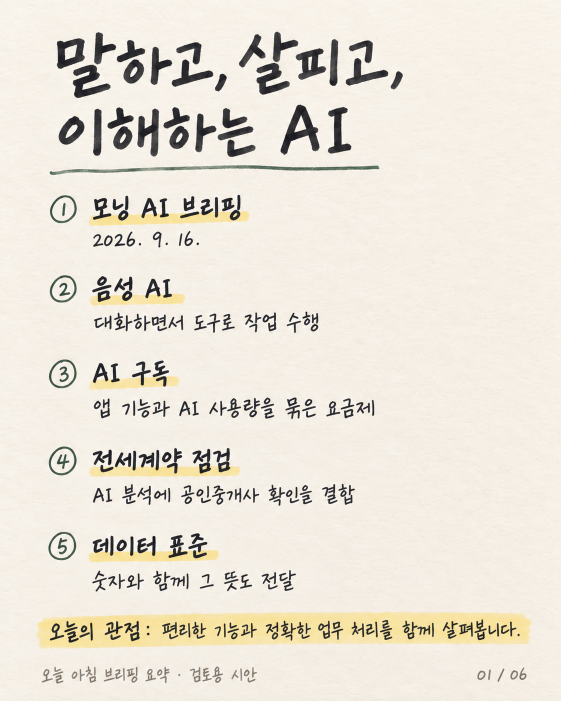
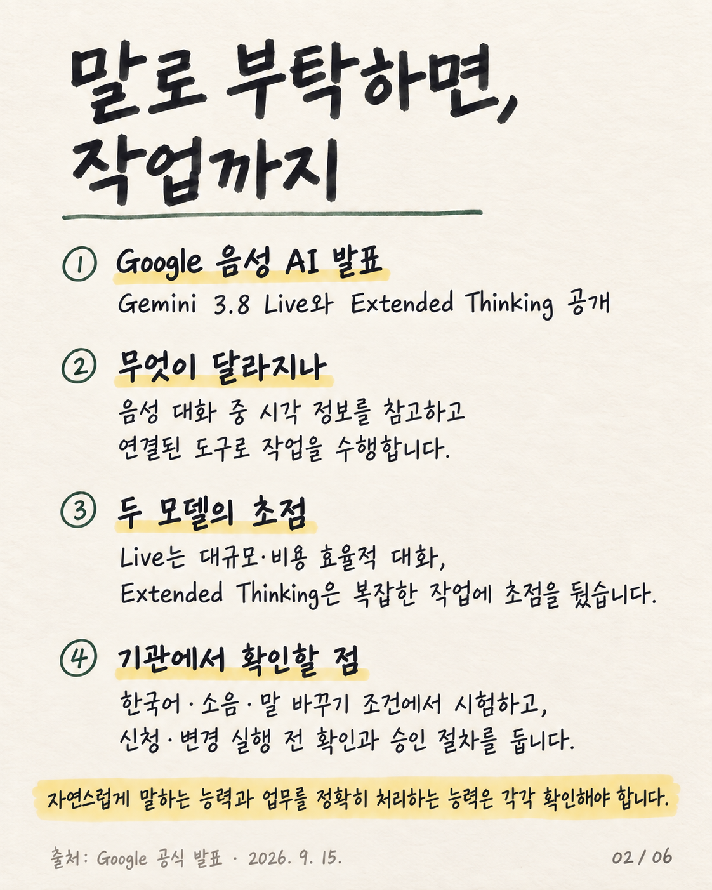
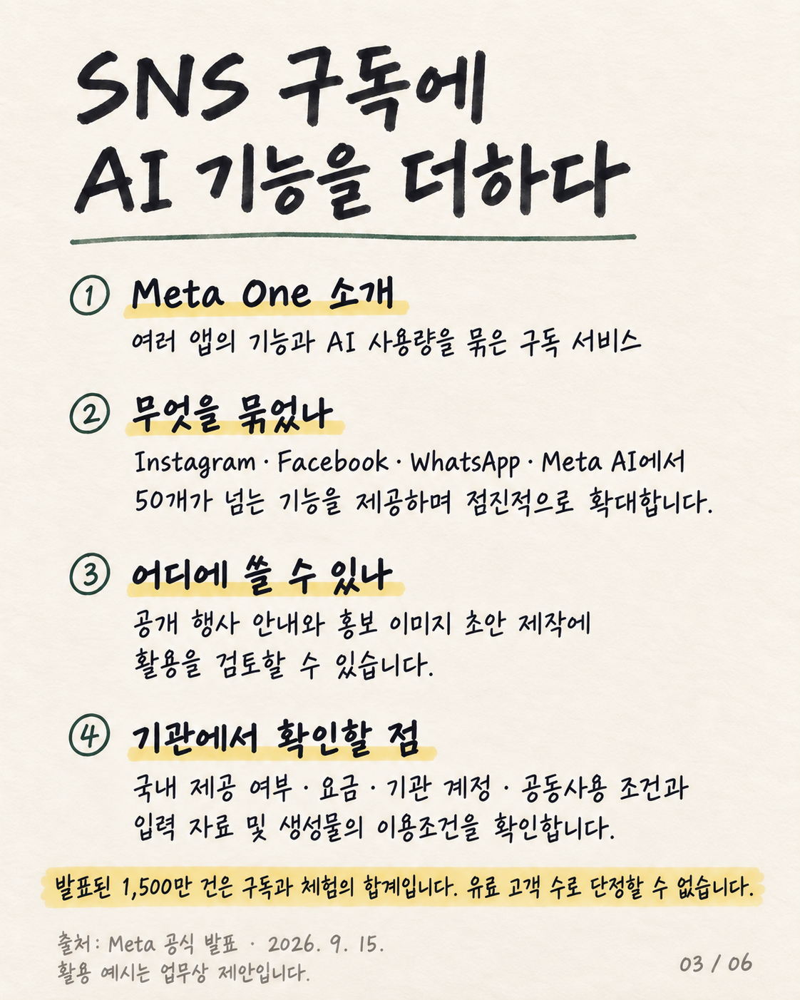
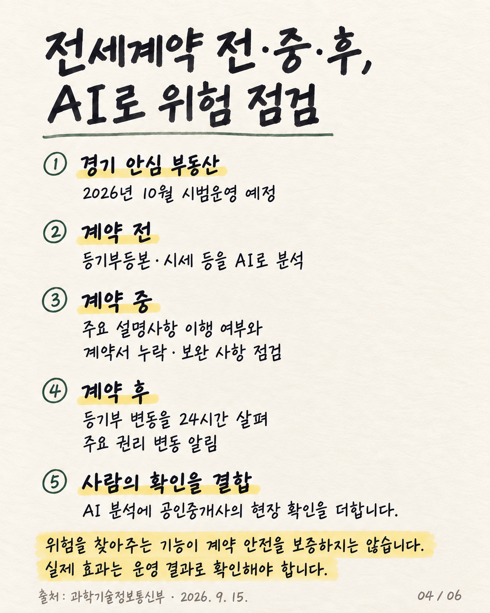
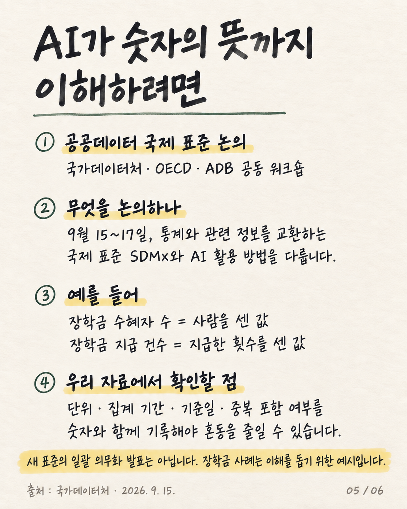
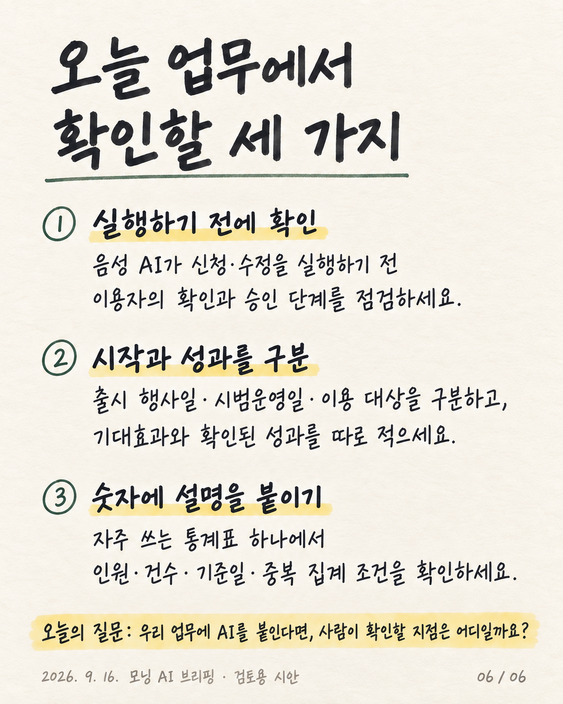

# 제작 샘플 S01–S07

[통합 목록](../assets/catalog.json)이 번호·경로·상태·외부 출처의 정본입니다. E로 시작하는 항목은 외부 참고 사례로, S 제작 샘플과 구분합니다. S06은 실험안입니다.

## S01 · 파란 입체형

- [생성 프롬프트](../assets/cover-styles/prompts/01.md)
- [주소 제거 편집 프롬프트](../assets/cover-styles/edit-prompts/01.md)
- 참고 출처: E03 ([통합 목록](../assets/catalog.json))
- 디자인 참고용; 재사용 시 원고 교체

## S02 · 메모지형

- [생성 프롬프트](../assets/cover-styles/prompts/02.md)
- [주소 제거 편집 프롬프트](../assets/cover-styles/edit-prompts/02.md)
- 참고 출처: E04 ([통합 목록](../assets/catalog.json))
- 디자인 참고용; 재사용 시 원고 교체

## S03 · 폴더형

- [생성 프롬프트](../assets/cover-styles/prompts/03.md)
- [주소 제거 편집 프롬프트](../assets/cover-styles/edit-prompts/03.md)
- 참고 출처: E05 ([통합 목록](../assets/catalog.json))
- 디자인 참고용; 재사용 시 원고 교체

## S04 · 기술 도해형

- [생성 프롬프트](../assets/cover-styles/prompts/04.md)
- [주소 제거 편집 프롬프트](../assets/cover-styles/edit-prompts/04.md)
- 참고 출처: E06 ([통합 목록](../assets/catalog.json))
- 디자인 참고용; 재사용 시 원고 교체

## S05 · 평면 정책형

- [생성 프롬프트](../assets/cover-styles/prompts/05.md)
- [주소 제거 편집 프롬프트](../assets/cover-styles/edit-prompts/05.md)
- 참고 출처: E07 ([통합 목록](../assets/catalog.json))
- 디자인 참고용; 재사용 시 원고 교체

## S06 · 사진형 — 실험안

- [생성 프롬프트](../assets/cover-styles/prompts/06.md)
- [주소 제거 편집 프롬프트](../assets/cover-styles/edit-prompts/06.md)
- 참고 출처: E08 ([통합 목록](../assets/catalog.json))
- 가상 인물; 배경 원고 외 장식 문구가 남은 실험안

번호를 유지한 채 새 원고로 제작합니다. 기존 기관명·날짜를 그대로 배포하지 않습니다. 같은 위계의 글자 크기 통일은 프롬프트와 육안검수 기준이며 픽셀 단위 자동 보장이 아닙니다.

## S07 · 텍스트 중심 손글씨 메모형

[디자인 기준·재사용 안내](handwritten-memo.md) · [표지 프롬프트](../assets/handwritten-memo/prompts/01.md)

크림색 종이에 먹색 펜, 녹색 밑줄과 연노랑 형광펜을 사용하는 텍스트 중심 디자인입니다. 아래는 동일 스타일로 생성한 후속 5장입니다. 뉴스 사실 확인용이 아닌 공개 승인 디자인 시안입니다.

[장별 프롬프트](../assets/handwritten-memo/prompts/02.md)

[장별 프롬프트](../assets/handwritten-memo/prompts/03.md)

[장별 프롬프트](../assets/handwritten-memo/prompts/04.md)

[장별 프롬프트](../assets/handwritten-memo/prompts/05.md)

[장별 프롬프트](../assets/handwritten-memo/prompts/06.md)
